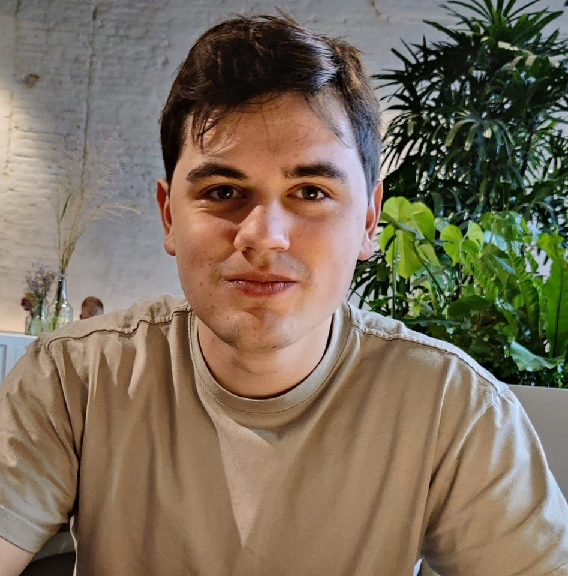

# Over mezelf

Hey! Mijn naam is Senne Dierick. Momenteel ben ik een 3de-jaars student binnen toegepaste informatica aan de hogeschool van Gent. Afgelopen semester heb ik mijn eerste werkervaring opgedaan binnen informatica. Deze ervaring heb ik opgedaan bij Becosoft.
In 2023 ben ik een semester op utwisseling geweest naar Zweden. Ik heb 5 maanden lang in Halmstad gewoond en ben daar, aan Högskolan i Halmstad, dan ook gaan studeren. Dit was een heel aangename ervaring. Sinds jong af aan ben ik al geïnteresseerd in informatica en computers. In mijn tienerjaren bouwde ik zelf computers voor mijn vrienden en mij. Momenteel beoefen ik 2 hobby's. De eerste hobby die ik al het langst doe is leiding geven in een jeugdbeweging (KSA). Mij nieuwere hobby is fitness, deze doe ik nog maar enkele jaren. Uiteindelijk ben ik informatica gaan studeren toen het foutliep in mijn eerste jaar ingenieur. Hier ontdekte ik wel dat ik een enorme interesse had in het vak informatica en heb ik beslist ddie richting dan ook uit te gaan. Om mij persoonlijkheid te beschrijven is het misschien best om de verschijdende testen te bekijken die binnen de testen folder te vinden zijn.

# Ervaringen
Tijdens mijn studentenjaren heb ik al enkele jobs gedaan in de vorm van vakantiejob. De taken die ik kreeg lagen ook heel erg uit elkaar. Zo heb ik gewerkt als loodgieter, postbode en magazijnier. Binnen informatica zijn dit misschien geen relevante werkervaringen, maar het geeft wel een brede waaier aan informatie over verschillende takken. De meer relevante ervaringen zijn de verschillende projecten die ik alleen of in groep gemaakt heb. Onder projecten staan 4 projecten, 2 die ik alleen gemaakt heb en 2 in groep. Linux en webservices zijn de solo projecten.