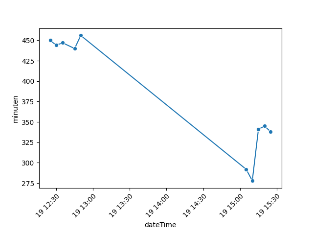

## Table of Contents  
  * [Data verzamelen en visualiseren over de NMBS](#data-verzamelen-en-visualiseren-over-de-nmbs)
    * [Totale vertraging](#totale-vertraging)
    * [Trein met de meeste vertraging](#trein-met-de-meeste-vertraging)
  
# Data verzamelen en visualiseren over de NMBS  
**2023-09-19 15:25:00**  
  
## Totale vertraging  
  
Deze data is gegenereerd door de momentele delay van alle treinen op te tellen en dan weer te geven op een grafiek. De vertraging wordt weergegeven per dag. De grafieken worden niet per dag opgeslagen maar deze zijn makkelijk te reproduceren door de datum aan te passen op lijn 9 en 10  
```  
dateTime = datetime.now()  
currentDate = datetime.date(dateTime)  
```  
  
## Trein met de meeste vertraging  
De trein de momenteel de hoogste vertraging heeft opgelopen is de:  
  
***met 16 minuten vertraging na het passeren van volgende halte: Bertrix***  
  
Dit resultaat is bekomen door het doorlopen van de realtime data. We zoeken eerst delaatste halte waar de trein gepasseerd is. Daarna vergelijken we de vertraging met de vertraging van de vorige treinen. Als dit gebeurd is zoeken we de route op die de trein aflegt en vertalen we de halte van Frans naar Nederlands.  
