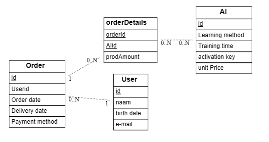
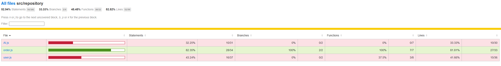
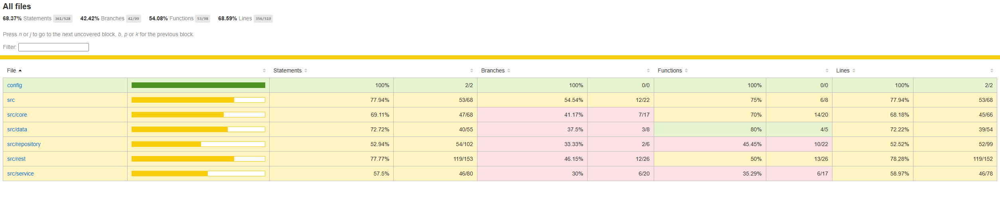

# Senne Dierick (185051sd)

> Duid aan welke vakken je volgt en vermeld voor deze vakken de link naar jouw GitHub repository. In het geval je slechts één vak volgt, verwijder alle inhoud omtrent het andere vak.
> Verwijder alle instructies (lijnen die starten met >)

- [ ] Front-end Web Development
  - [GitHub repository](github.com/HOGENT-Web)
  - [Online versie](github.com/HOGENT-Web)
- [x] Web Services:
  - [GitHub repository](https://github.com/Web-IV/2223-webservices-Sdierick20)
  - [Online versie](https://two223-webservices-sdierick20.onrender.com)


## Projectbeschrijving

> De API zou een webshop ondersteunen die AI modellen verkoopt. De meeste modellen worden op maat gemaakt maar enkele basismodellen zullen meerdere malen te verkrijgen zijn.
```kroki-Erd
[AI]
*id
'Learning method'
'Training time'
'activation key'
'unit Price'

[Order]
*id
Userid
'Order date'
'Delivery date'
'Payment method'

[orderDetails]
*orderId
*AIid
prodAmount

[User]
*id
naam
'birth date'
'e-mail'

Order *--1 User
Order 1--* orderDetails
orderDetails *--* AI
```


## Behaalde minimumvereisten


### Front-end Web Development

- **componenten**

  - [ ] heeft meerdere componenten - dom & slim (naast login/register)
  - [ ] definieert constanten (variabelen, functies en componenten) buiten de component
  - [ ] minstens één form met validatie (naast login/register)
  - [ ] login systeem (eigen of extern zoals bv. Auth0)
<br />

- **routing**
  - [ ] heeft minstens 2 pagina's (naast login/register)
  - [ ] routes worden afgeschermd met authenticatie en autorisatie
<br />

- **state-management**

  - [ ] meerdere API calls (naast login/register)
  - [ ] degelijke foutmeldingen indien API call faalt
  - [ ] gebruikt useState enkel voor lokale state
  - [ ] gebruikt Context, useReducer, Redux… voor globale state
<br />

- **hooks**

  - [ ] kent het verschil tussen de hooks (useCallback, useEffect…)
  - [ ] gebruikt de hooks op de juiste manier
<br />

- **varia**
  - [ ] een aantal niet-triviale testen (unit en/of e2e en/of ui)
  - [ ] minstens één extra technologie
  - [ ] duidelijke en volledige README.md
  - [ ] volledig en tijdig ingediend dossier


### Web Services

- **datalaag**

  - [x] voldoende complex (meer dan één tabel)
  - [x] één module beheert de connectie + connectie wordt gesloten bij sluiten server
  - [x] heeft migraties
  - [x] heeft seeds
<br />

- **repositorylaag**

  - [x] definieert één repository per entiteit (niet voor tussentabellen) - indien van toepassing
  - [x] mapt OO-rijke data naar relationele tabellen en vice versa
<br />

- **servicelaag met een zekere complexiteit**

  - [x] bevat alle domeinlogica
  - [x] bevat geen SQL-queries of databank-gerelateerde code
<br />

- **REST-laag**

  - [x] meerdere routes met invoervalidatie
  - [x] degelijke foutboodschappen
  - [x] volgt de conventies van een RESTful API
  - [x] bevat geen domeinlogica
  - [x] degelijke authorisatie/authenticatie op alle routes
<br />

- **varia**
  - [x] een aantal niet-triviale testen (min. 1 controller >=80% coverage)
  - [x] minstens één extra technologie
  - [x] duidelijke en volledige `README.md`
  - [x] maakt gebruik van de laatste ES6-features (object destructuring, spread operator...)
  - [x] volledig en tijdig ingediend dossier


## Projectstructuur

### Front-end Web Development


### Web Services

> De webservice maakt gebruik van 4 hoofdmappen: data, repository, service en rest. 
In de datamap staan de migrations en de seeds voor de databank net zoals een `index.js` file die de connectie met de databank beheert.  
In de repositorymap worden de query's uitgevoerd op de databank en omgezet worden naar een handig formaat om mee aan het werk te gaan. Hier staan volgende bestanden in: `AI.js`, `user.js` en `order.js` en dus geen map voor de tussentabel.  
In de service map wordt de repository aangeroepen met de juist gemapte data en als er een fout optreed zal deze juist afgehandeld worden.  
in de rest map komen de verzoeken binnen en zullen ze geroute worden naar de juiste functie om zo verder de service aan te spreken voor de juiste data uit de databank. Hier zal de input eerst gevalideerd worden en checken of je wel toegang hebt tot de juiste operaties.  
Daarnaast is er een core map die de authorisatie, logging en serviceErrors afhandeld.  
daarnaast zijn er ook nog testen voor elke tabel van de databank (behalve tussentabel).


## Extra technologie

### Front-end Web Development


### Web Services

> De testen zijn geschreven in Mocha en chai. Er is linting toegepast op de code. API documentatie in swagger.

## Testresultaten

### Front-end Web Development

> Schrijf hier een korte oplijsting en beschrijving van de geschreven testen

### Web Services

> Er zijn testen geschreven voor elke CRUD operatie bij slagen en falen. De testen zijn bedoeld om meer dan 80% coverage te halen op elk bestand.  
Door een bug met axios dat ik niet opgelost krijg kan ik amper nog testen uitvoeren. Onderstaand screenshot is met de testen op orders en 1 test op user. De testen zijn toch aangevuld en in elk repositorybestand zou er een coverage moeten zijn van meer dan 80% mocht de bug opgelost zijn.
  


## Gekende bugs

### Front-end Web Development


### Web Services

> status code 429 bij het runnen van de testen.  
Datum kan een dag verspringen.  
Swagger geeft een error bij het testen van de API en toont geen voorbeeld van orders.

